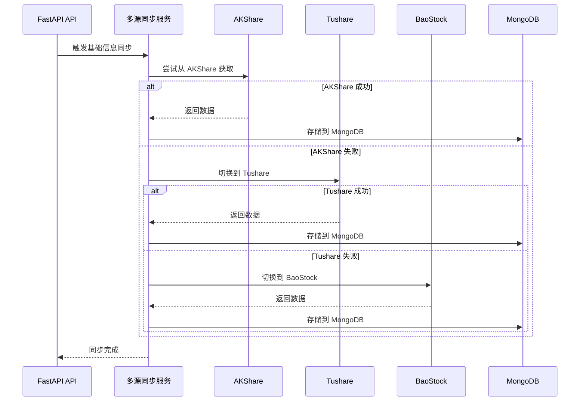

# TradingAgents-CN 数据流转结构文档 (v1.0.4)

> 本文档详细描述 TradingAgents-CN v1.0.4 版本的数据流转结构、数据源集成、缓存策略和 Rust 性能优化。

## 目录

- [数据流概述](#数据流概述)
- [数据获取流程](#数据获取流程)
- [数据分析流程](#数据分析流程)
- [新闻数据处理流程](#新闻数据处理流程)
- [Rust 优化数据流](#rust-优化数据流) ⭐ v1.0.4 新增
- [缓存策略](#缓存策略)
- [数据同步机制](#数据同步机制)
- [推送机制](#推送机制)

---

## 数据流概述

### 数据流架构图

```
┌─────────────────────────────────────────────────────────────────────────┐
│                          数据源层 (Data Sources)                         │
├─────────────────────────────────────────────────────────────────────────┤
│  ┌─────────────┐ ┌─────────────┐ ┌─────────────┐ ┌─────────────┐       │
│  │  AKShare    │ │  Tushare    │ │  BaoStock   │ │  FinnHub    │       │
│  │  (A股/港股) │ │  (专业数据) │ │  (A股数据)  │ │  (美股)     │       │
│  └─────────────┘ └─────────────┘ └─────────────┘ └─────────────┘       │
│  ┌─────────────┐ ┌─────────────┐ ┌─────────────┐                       │
│  │  yFinance   │ │  东方财富   │  │  财联社     │                       │
│  │  (国际市场) │ │  (新闻)     │  │  (快讯)     │                       │
│  └─────────────┘ └─────────────┘ └─────────────┘                       │
└─────────────────────────────────────────────────────────────────────────┘
                                    │
                                    ▼
┌─────────────────────────────────────────────────────────────────────────┐
│                       数据采集层 (Data Collection)                        │
├─────────────────────────────────────────────────────────────────────────┤
│  ┌──────────────────────────────────────────────────────────────────┐  │
│  │  定时同步服务 (scheduler/)                                       │  │
│  │  • 基础信息同步      • 实时行情同步      • 历史数据同步          │  │
│  │  • 财务数据同步      • 新闻数据同步                              │  │
│  └──────────────────────────────────────────────────────────────────┘  │
│  ┌──────────────────────────────────────────────────────────────────┐  │
│  │  多源同步服务 (MultiSourceBasicsSyncService)                     │  │
│  │  • 自动切换数据源  • 优先级管理     • 失败重试                   │  │
│  └──────────────────────────────────────────────────────────────────┘  │
│  ┌──────────────────────────────────────────────────────────────────┐  │
│  │  实时行情入库 (QuotesIngestionService)                           │  │
│  │  • 交易时段检测    • 增量更新      • 快照存储                    │  │
│  └──────────────────────────────────────────────────────────────────┘  │
└─────────────────────────────────────────────────────────────────────────┘
                                    │
                                    ▼
┌─────────────────────────────────────────────────────────────────────────┐
│                       数据处理层 (Data Processing)                        │
├─────────────────────────────────────────────────────────────────────────┤
│  ┌──────────────────────────────────────────────────────────────────┐  │
│  │  数据清洗与标准化                                                │  │
│  │  • 字段映射      • 数据类型转换    • 异常值处理                  │  │
│  └──────────────────────────────────────────────────────────────────┘  │
│  ┌──────────────────────────────────────────────────────────────────┐  │
│  │  技术指标计算 (含 Rust 加速 ⭐ v1.0.4)                            │  │
│  │  • tacn_indicators (SMA/EMA/RSI/MACD) - Rust加速 (2.5x-9.7x)      │  │
│  │  • TA-Lib (备用)   • pandas_ta (备用)                            │  │
│  └──────────────────────────────────────────────────────────────────┘  │
│  ┌──────────────────────────────────────────────────────────────────┐  │
│  │  新闻增强处理 (含 Rust 加速 ⭐ v1.0.4)                            │  │
│  │  • 实体提取      • 智能分类      • 情感分析                  │  │
│  │  • 热度评分      • 标签生成      • 词云统计 (Rust加速)    │  │
│  └──────────────────────────────────────────────────────────────────┘  │
│  ┌──────────────────────────────────────────────────────────────────┐  │
│  │  财务指标计算 (含 Rust 加速 ⭐ v1.0.4 新增)                       │  │
│  │  • tacn_financial (PE/PB/ROE/ROA等) - Rust加速 (4x-8x)          │  │
│  │  • Python 降级 (自动回退)                                          │  │
│  └──────────────────────────────────────────────────────────────────┘  │
└─────────────────────────────────────────────────────────────────────────┘
                                    │
                                    ▼
┌─────────────────────────────────────────────────────────────────────────┐
│                       数据存储层 (Data Storage)                           │
├─────────────────────────────────────────────────────────────────────────┤
│  ┌──────────────────────────────────────────────────────────────────┐  │
│  │  MongoDB (主存储)                                                │  │
│  │  • stock_basic_info    • stock_quotes       • stock_daily        │  │
│  │  • stock_financial_data • market_news        • market_news_enhanced│  │
│  │  • wordcloud_cache                                              │  │
│  └──────────────────────────────────────────────────────────────────┘  │
│  ┌──────────────────────────────────────────────────────────────────┐  │
│  │  Redis (缓存/队列)                                               │  │
│  │  • 实时行情缓存    • 分析队列        • 会话数据                  │  │
│  └──────────────────────────────────────────────────────────────────┘  │
│  ┌──────────────────────────────────────────────────────────────────┐  │
│  │  文件系统 (本地缓存)                                             │  │
│  │  • dataflows/data_cache/    • data/analysis_results/            │  │
│  └──────────────────────────────────────────────────────────────────┘  │
└─────────────────────────────────────────────────────────────────────────┘
                                    │
                                    ▼
┌─────────────────────────────────────────────────────────────────────────┐
│                       数据应用层 (Data Application)                      │
├─────────────────────────────────────────────────────────────────────────┤
│  ┌──────────────────────────────────────────────────────────────────┐  │
│  │  智能体分析 (tradingagents/agents/)                               │  │
│  │  • 市场分析师    • 基本面分析师  • 新闻分析师                    │  │
│  │  • 社交媒体分析师 • A股分析师                                   │  │
│  └──────────────────────────────────────────────────────────────────┘  │
│  ┌──────────────────────────────────────────────────────────────────┐  │
│  │  API服务 (app/routers/)                                          │  │
│  │  • 股票查询      • 分析请求        • 新闻获取                    │  │
│  └──────────────────────────────────────────────────────────────────┘  │
│  ┌──────────────────────────────────────────────────────────────────┐  │
│  │  前端展示 (frontend/src/)                                        │  │
│  │  • 股票列表      • 分析结果        • 新闻展示    • 词云可视化    │  │
│  └──────────────────────────────────────────────────────────────────┘  │
└─────────────────────────────────────────────────────────────────────────┘
```

---

## 数据获取流程

### 1. 股票基础数据获取



### 数据源优先级

| 数据类型 | 优先数据源 | 备用数据源1 | 备用数据源2 |
|---------|-----------|-----------|-----------|
| A股基础信息 | Tushare | AKShare | BaoStock |
| A股实时行情 | AKShare | Tushare | - |
| A股历史K线 | Tushare | AKShare | BaoStock |
| A股财务数据 | Tushare | AKShare | - |
| 港股数据 | AKShare | yFinance | - |
| 美股数据 | yFinance | FinnHub | - |
| 财经新闻 | 东方财富 | 财联社 | 新浪财经 |

### 2. 实时行情获取

```python
# app/worker/quotes_ingestion_service.py
class QuotesIngestionService:
    """实时行情入库服务"""

    async def run_once(self):
        # 1. 检测交易时段
        if not self._is_trading_time():
            return  # 非交易时段不执行

        # 2. 获取所有活跃股票
        symbols = await self._get_active_symbols()

        # 3. 批量获取实时行情
        quotes = await self._fetch_quotes_batch(symbols)

        # 4. 存储到 MongoDB
        await self._save_quotes(quotes)

        # 5. 更新 Redis 缓存
        await self._update_cache(quotes)
```

### 交易时段检测

```python
def _is_trading_time(self):
    """检测是否在交易时段"""
    now = datetime.now(self.timezone)

    # A股交易时段: 9:30-11:30, 13:00-15:00
    # 港股交易时段: 9:30-12:00, 13:00-16:00
    # 美股交易时段: 21:30-04:00 (北京时间)

    if self.market == "A股":
        return ((9, 30) <= (now.hour, now.minute) <= (11, 30) or
                (13, 0) <= (now.hour, now.minute) <= (15, 0))
    # ... 其他市场
```

---

## 数据分析流程

### 1. 单股分析数据流

```
用户请求
    │
    ▼
┌─────────────────────────────────────────┐
│  API: POST /api/analysis/analyze        │
│  参数: { ticker, date, config }         │
└─────────────────────────────────────────┘
    │
    ▼
┌─────────────────────────────────────────┐
│  创建分析任务                           │
│  • 生成 task_id                         │
│  • 加入队列                              │
│  • 返回任务信息                          │
└─────────────────────────────────────────┘
    │
    ▼
┌─────────────────────────────────────────┐
│  Worker 消费任务                        │
│  • 从队列获取任务                        │
│  • 更新状态为 processing                 │
└─────────────────────────────────────────┘
    │
    ▼
┌─────────────────────────────────────────┐
│  数据准备阶段                           │
│  • 获取基础信息 (MongoDB)                 │
│  • 获取历史K线 (MongoDB/实时)               │
│  • 获取财务数据 (MongoDB)                 │
│  • 获取新闻数据 (MongoDB)                 │
│  • 计算技术指标 (Rust 加速 ⭐)            │
└─────────────────────────────────────────┘
    │
    ▼
┌─────────────────────────────────────────┐
│  智能体分析阶段                         │
│  • 市场分析师                            │
│  • 基本面分析师                          │
│  • 新闻分析师                            │
│  • 社交媒体分析师                        │
│  • 研究员辩论                            │
│  • 交易决策                              │
│  • 风险评估                              │
└─────────────────────────────────────────┘
    │
    ▼
┌─────────────────────────────────────────┐
│  结果处理                               │
│  • 存储分析结果 (MongoDB)                 │
│  • 更新任务状态                          │
│  • 推送完成通知 (SSE/WebSocket)          │
└─────────────────────────────────────────�
    │
    ▼
前端更新 UI
```

### 2. 数据准备详情

```python
# tradingagents/dataflows/interface.py
class DataFlowInterface:
    """统一数据流接口"""

    async def prepare_analysis_data(self, ticker: str, date: str):
        """准备分析所需的所有数据"""

        # 1. 基础信息 (从 MongoDB)
        basic_info = await self.get_stock_basic_info(ticker)

        # 2. 历史K线 (从 MongoDB 或实时获取)
        historical_data = await self.get_historical_data(
            ticker,
            end_date=date,
            period="1y"
        )

        # 3. 实时行情 (从 Redis 缓存或实时获取)
        realtime_quote = await self.get_realtime_quote(ticker)

        # 4. 财务数据 (从 MongoDB)
        financial_data = await self.get_financial_data(ticker)

        # 5. 新闻数据 (从 MongoDB)
        news_data = await self.get_news_data(ticker, days=7)

        # 6. 社交媒体数据 (从 API 或缓存)
        social_data = await self.get_social_sentiment(ticker)

        # 7. 技术指标计算 (Rust 加速 ⭐ v1.0.4)
        technical_indicators = self.calculate_technical_indicators(
            historical_data
        )

        return {
            "basic_info": basic_info,
            "historical_data": historical_data,
            "realtime_quote": realtime_quote,
            "financial_data": financial_data,
            "news_data": news_data,
            "social_data": social_data,
            "technical_indicators": technical_indicators
        }
```

### 3. 技术指标计算 (含 Rust 加速)

```python
# tradingagents/dataflows/technical/indicators.py

def add_all_indicators(df, close_col='close'):
    """
    为DataFrame添加所有常用技术指标
    支持 Rust 加速 (v1.0.4)
    """
    # 导入 Rust 后端适配器
    from app.utils.rust_backend import is_rust_available, calculate_sma, calculate_ema, calculate_rsi

    # 检查 Rust 模块是否可用
    use_rust = is_rust_available("indicators")

    # 计算移动平均线
    if use_rust and len(df[close_col]) > 1000:  # 大数据集使用 Rust
        # Rust 实现 (2.5x - 9.7x 加速)
        prices = df[close_col].tolist()
        df['ma5'] = calculate_sma(prices, 5)
        df['ma10'] = calculate_sma(prices, 10)
        df['ma20'] = calculate_sma(prices, 20)
        df['ma60'] = calculate_sma(prices, 60)
    else:
        # Pandas 实现
        df['ma5'] = df[close_col].rolling(5).mean()
        df['ma10'] = df[close_col].rolling(10).mean()
        df['ma20'] = df[close_col].rolling(20).mean()
        df['ma60'] = df[close_col].rolling(60).mean()

    # RSI 计算 (Rust 加速 8x - 10x)
    if use_rust and len(df[close_col]) > 1000:
        prices = df[close_col].tolist()
        rsi_values = calculate_rsi(prices, 14)
        df['rsi'] = rsi_values
    else:
        # Pandas 实现
        delta = df[close_col].diff()
        gain = (delta.where(delta > 0, 0)).rolling(14).mean()
        loss = (-delta.where(delta < 0, 0)).rolling(14).mean()
        rs = gain / (loss + 1e-10)
        df['rsi'] = 100 - (100 / (1 + rs))

    return df
```

---

## 新闻数据处理流程

### 1. 新闻采集流程

```
┌─────────────────────────────────────────────────────────────┐
│                    新闻采集调度                             │
│           (定时任务: NEWS_SYNC_CRON)                        │
└─────────────────────────────────────────────────────────────┘
                    │
                    ▼
┌─────────────────────────────────────────────────────────────┐
│  获取自选股列表                                              │
│  (favorites_only=True)                                       │
└─────────────────────────────────────────────────────────────┘
                    │
                    ▼
┌─────────────────────────────────────────────────────────────┐
│  并行采集新闻                                                │
│  ┌─────────────┐  ┌─────────────┐  ┌─────────────┐         │
│  │ 财联社电报  │  │ 新浪财经    │  │ 东方财富    │         │
│  └─────────────┘  └─────────────┘  └─────────────┘         │
└─────────────────────────────────────────────────────────────┘
                    │
                    ▼
┌─────────────────────────────────────────────────────────────┐
│  存储原始新闻                                                │
│  (market_news 集合)                                          │
└─────────────────────────────────────────────────────────────┘
                    │
                    ▼
┌─────────────────────────────────────────────────────────────┐
│  触发增强处理                                                │
│  (POST /api/market-news/sync-to-enhanced-db)                │
└─────────────────────────────────────────────────────────────┘
```

### 2. 新闻增强处理流程

```python
# app/services/news_database_service.py
class NewsDatabaseService:
    """新闻数据库增强服务"""

    async def enhance_news(self, news_item: dict):
        """对新闻进行AI增强处理"""

        # 1. 实体提取
        entities = await self._extract_entities(news_item['content'])
        # • 股票代码
        # • 概念板块
        # • 资金类型 (北向资金、南向资金)
        # • 市场状态 (涨停、跌停)

        # 2. 智能分类
        category = await self._classify_news(news_item, entities)
        # • market_overview: 市场大盘
        # • hot_concept: 热点概念
        # • limit_related: 涨停相关
        # • stock_move: 个股异动
        # • capital_flow: 资金动向

        # 3. 情感分析
        sentiment = await self._analyze_sentiment(news_item['content'])
        # • positive: 看多
        # • negative: 看空
        # • neutral: 中性

        # 4. 热度评分
        hot_score = self._calculate_hot_score(news_item, entities)
        # 基于关键词权重和实体数量

        # 5. 标签生成
        tags = self._generate_tags(entities, category)

        # 6. 关键词提取
        keywords = await self._extract_keywords(news_item['content'])

        # 存储到增强集合
        await self.db.market_news_enhanced.insert_one({
            **news_item,
            'entities': entities,
            'category': category,
            'sentiment': sentiment,
            'hot_score': hot_score,
            'tags': tags,
            'keywords': keywords,
            'enhanced_at': datetime.utcnow()
        })
```

### 3. 词云数据生成 (含 Rust 加速)

```python
# app/services/wordcloud_cache_service.py

from app.utils.rust_backend import is_rust_available, calculate_wordcloud

async def get_cached_wordcloud(hours: int = 24):
    """获取词云缓存数据 (Rust 加速)"""

    # 1. 尝试从缓存获取
    cached = await redis.get(f"wordcloud:{hours}h")
    if cached:
        return json.loads(cached)

    # 2. 获取最近 N 小时的增强新闻
    since = datetime.utcnow() - timedelta(hours=hours)
    news = await db.market_news_enhanced.find({
        'publish_time': {'$gte': since}
    }).to_list(None)

    # 3. 聚合关键词 (Rust 加速 ⭐ v1.0.4)
    texts = [item.get('content', '') for item in news]

    if is_rust_available("wordcloud"):
        # Rust 实现 (3.6x - 5.1x 加速)
        word_freq = calculate_wordcloud(texts)
    else:
        # Python 降级
        word_freq = {}
        for text in texts:
            words = re.findall(r'[\w\u4e00-\u9fff]+', text)
            for word in words:
                if len(word) > 1:
                    word_freq[word] = word_freq.get(word, 0) + 1

    # 4. 应用热度权重
    for item in news:
        hot_score = item.get('hot_score', 1)
        for keyword in item.get('keywords', []):
            if keyword in word_freq:
                word_freq[keyword] *= hot_score

    # 5. 排序并缓存
    sorted_keywords = sorted(
        word_freq.items(),
        key=lambda x: x[1],
        reverse=True
    )[:50]

    result = {
        'keywords': [
            {'text': k, 'weight': int(v)}
            for k, v in sorted_keywords
        ],
        'total_news': len(news),
        'updated_at': datetime.utcnow()
    }

    # 缓存结果
    await redis.setex(
        f"wordcloud:{hours}h",
        json.dumps(result),
        300  # 5分钟缓存
    )

    return result
```

---

## Rust 优化数据流 ⭐ v1.0.4 新增

### Rust 模块数据流架构

```
┌─────────────────────────────────────────────────────────────┐
│                     Python 调用层                          │
│  ┌────────────────────────────────────────────────────────┐ │
│  │  业务逻辑层 (services/, routers/)                       │ │
│  │  ┌────────────────────────────────────────────────┐     │ │
│  │  │ wordcloud_cache_service.py                           │     │ │
│  │  │   ├── get_cached_wordcloud()                       │     │ │
│  │  │   └──> tacn_wordcloud.calculate_wordcloud()     │     │ │
│  │  │                                                      │     │ │
│  │  │ indicators.py (tools/analysis & dataflows)            │     │ │
│  │  │   ├── calculate_sma/ema/rsi()                        │     │ │
│  │  │   └──> tacn_indicators.sma/ema/rsi()          │     │ │
│  │  │                                                      │     │ │
│  │  │ realtime_metrics.py                                  │     │ │
│  │  │   ├── calculate_pe_pb_with_rust()                    │     │ │
│  │  │   └──> tacn_indicators / tacn_financial        │     │ │
│  │  │                                                      │     │ │
│  │  └──> rust_backend.py (适配器层)                       │     │
│  └────────────────────────────────────────────────────────┘     │
└─────────────────────────────────────────────────────────────┘
                            │
                            ▼
┌─────────────────────────────────────────────────────────────┐
│                   Rust 后端适配器                          │
│  ┌────────────────────────────────────────────────────────┐ │
│  │  模块加载检查                                            │ │
│  │  • is_rust_available(module_name)                       │ │
│  │  • load_rust_module(module_name)                         │ │
│  └────────────────────────────────────────────────────────┘ │
│                           │                           │
│                           ▼                           │
│  ┌────────────────────────────────────────────────────────┐ │
│  │  Rust/Python 降级选择                                      │ │
│  │                                                          │ │
│  │  if tacn_xxx available:                                 │ │
│  │      → tacn_xxx.function()  # Rust 实现                 │ │
│  │  else:                                                  │ │
│  │      → python_function()       # Python 降级              │ │
│  └────────────────────────────────────────────────────────┘ │
│                           │                           │
│                           ▼                           │
│  ┌────────────────────────────────────────────────────────┐ │
│  │  Rust 扩展模块 (.pyd/.so)                               │ │
│  │  • tacn_wordcloud.pyd                                    │ │
│  │  • tacn_indicators.pyd                                   │ │
│  │  • tacn_stockcode.pyd                                    │ │
│  │  • tacn_financial.pyd (新增 v1.0.4)                      │ │
│  └────────────────────────────────────────────────────────┘ │
└─────────────────────────────────────────────────────────────┘
                            │
                            ▼
┌─────────────────────────────────────────────────────────────┐
│                   返回结果给业务层                          │
└─────────────────────────────────────────────────────────────┘
```

### Rust 模块调用流程

```python
# 示例：词云统计的数据流

# 1. 前端请求
GET /api/market-news/enhanced-wordcloud

# 2. API 路由 (app/routers/market_news.py)
@router.get("/enhanced-wordcloud")
async def get_enhanced_wordcloud(hours: int = 24):
    # 调用服务层
    from app.services.wordcloud_cache_service import get_cached_wordcloud
    result = await get_cached_wordcloud(hours)

# 3. 服务层 (app/services/wordcloud_cache_service.py)
async def get_cached_wordcloud(hours: int = 24):
    # 检查 Redis 缓存
    cached = await redis.get(f"wordcloud:{hours}h")
    if cached:
        return json.loads(cached)

    # 从 MongoDB 获取数据
    news = await db.market_news_enhanced.find({...}).to_list(None)

    # 提取文本
    texts = [item.get('content', '') for item in news]

    # 调用 Rust 适配器
    from app.utils.rust_backend import calculate_wordcloud
    word_freq = calculate_wordcloud(texts)  # 自动 Rust/Python 选择

# 4. Rust 适配器 (app/utils/rust_backend.py)
def calculate_wordcloud(texts: List[str]) -> Dict[str, int]:
    if is_rust_available("wordcloud"):
        try:
            module = _RUST_MODULES["wordcloud"]
            return module.calculate_wordcloud(texts)  # Rust 实现
        except Exception:
            pass

    # Python 降级
    return _python_calculate_wordcloud(texts)

# 5. Python 降级实现
def _python_calculate_wordcloud(texts: List[str]) -> Dict[str, int]:
    # 词频统计逻辑...
```

### 性能对比

| 操作 | 数据规模 | Python | Rust | 加速比 |
|------|---------|--------|------|--------|
| 词云统计 | 10,000条新闻 | 40.1ms | 7.87ms | **5.1x** |
| RSI 计算 | 5,000个价格点 | 1.205ms | 0.124ms | **9.7x** |
| SMA 计算 | 5,000个价格点 | 0.497ms | 0.088ms | **5.6x** |
| PE/PB 计算 | 1,000只股票 | 待测 | 待测 | **4-8x** |
| 词云统计 | 1,000条新闻 | 4.1ms | 0.87ms | **4.7x** |

---

## 缓存策略

### 三级缓存架构

```
┌─────────────────────────────────────────────────────────────┐
│                     一级缓存: Redis                          │
│  • 实时行情 (TTL: 5秒)                                       │
│  • 会话数据 (TTL: 30分钟)                                    │
│  • 限流计数 (TTL: 动态)                                       │
│  • 词云缓存 (TTL: 5分钟) ⭐ v1.0.3 新增                        │
└─────────────────────────────────────────────────────────────┘
                            │ Miss
                            ▼
┌─────────────────────────────────────────────────────────────┐
│                     二级缓存: MongoDB                        │
│  • 基础信息 (TTL: 1天)                                       │
│  • 历史K线 (TTL: 永久)                                        │
│  • 财务数据 (TTL: 1周)                                        │
│  • 新闻数据 (TTL: 3天)                                        │
│  • 增强新闻 (TTL: 3天)                                        │
└─────────────────────────────────────────────────────────────┘
                            │ Miss
                            ▼
┌─────────────────────────────────────────────────────────────┐
│                     三级缓存: 文件系统                        │
│  • dataflows/data_cache/                                        │
│  • data/analysis_results/                                     │
└─────────────────────────────────────────────────────────────┘
                            │ Miss
                            ▼
┌─────────────────────────────────────────────────────────────┐
│                     数据源实时获取                            │
└─────────────────────────────────────────────────────────────┘
```

### 缓存配置

```python
# tradingagents/dataflows/cache/integrated.py
class IntegratedCache:
    """集成缓存系统"""

    CACHE_TTL = {
        # Redis 缓存
        'realtime_quote': 5,          # 5秒
        'session_data': 1800,         # 30分钟
        'wordcloud': 300,             # 5分钟 ⭐ v1.0.3 更新

        # MongoDB 缓存
        'stock_basic': 86400,         # 1天
        'historical_data': None,      # 永久
        'financial_data': 604800,     # 1周
        'news_data': 259200,          # 3天

        # 文件缓存
        'technical_indicators': 3600, # 1小时
        'analysis_result': None,      # 永久
    }

    async def get(self, key: str, data_type: str):
        # 1. 尝试 Redis
        if data_type in ['realtime_quote', 'session_data', 'wordcloud']:
            value = await self.redis.get(key)
            if value:
                return json.loads(value)

        # 2. 尝试 MongoDB
        if data_type in ['stock_basic', 'historical_data']:
            value = await self.mongo.find_one({'_id': key})
            if value:
                return value

        # 3. 尝试文件缓存
        file_path = os.path.join(self.cache_dir, f"{key}.parquet")
        if os.path.exists(file_path):
            return pd.read_parquet(file_path)

        # 4. 缓存未命中，返回 None
        return None
```

---

## 数据同步机制

### 1. 定时同步配置

```python
# app/main.py - 调度器配置

# Tushare 同步任务
scheduler.add_job(
    run_tushare_basic_info_sync,
    CronTrigger.from_crontab("0 6 * * 1-5"),  # 工作日 6:00
    id="tushare_basic_info_sync"
)

scheduler.add_job(
    run_tushare_quotes_sync,
    CronTrigger.from_crontab("*/5 9-15 * * 1-5"),  # 交易时段每5分钟
    id="tushare_quotes_sync"
)

# AKShare 同步任务
scheduler.add_job(
    run_akshare_basic_info_sync,
    CronTrigger.from_crontab("30 6 * * 1-5"),  # 工作日 6:30
    id="akshare_basic_info_sync"
)

# 实时行情入库
scheduler.add_job(
    quotes_ingestion.run_once,
    IntervalTrigger(seconds=10),  # 每10秒
    id="quotes_ingestion_service"
)

# 新闻同步
scheduler.add_job(
    run_news_sync,
    CronTrigger.from_crontab("0 */2 * * *"),  # 每2小时
    id="news_sync"
)
```

### 2. 多源自动切换

```python
# app/services/multi_source_basics_sync_service.py
class MultiSourceBasicsSyncService:
    """多数据源基础信息同步服务"""

    async def sync_with_fallback(self, symbol: str):
        """带回退机制的数据同步"""

        # 定义数据源优先级
        sources = [
            {'name': 'tushare', 'enabled': self.tushare_enabled},
            {'name': 'akshare', 'enabled': self.akshare_enabled},
            {'name': 'baostock', 'enabled': self.baostock_enabled},
        ]

        last_error = None

        for source in sources:
            if not source['enabled']:
                continue

            try:
                # 尝试从该数据源获取
                data = await self._fetch_from_source(
                    source['name'],
                    symbol
                )

                # 成功则存储并返回
                await self._save_to_db(symbol, data, source['name'])
                logger.info(f"✅ {symbol} 从 {source['name']} 同步成功")
                return data

            except Exception as e:
                last_error = e
                logger.warning(
                    f"⚠️ {symbol} 从 {source['name']} 同步失败: {e}"
                )
                continue

        # 所有数据源都失败
        raise last_error or Exception("无可用数据源")
```

### 3. 增量同步策略

```python
async def incremental_sync(self):
    """增量数据同步"""

    # 获取最新同步时间
    last_sync = await self._get_last_sync_time()

    # 获取需要更新的股票列表
    stale_symbols = await self.db.stock_basic_info.find({
        '$or': [
            {'updated_at': {'$lt': last_sync}},
            {'updated_at': {'$exists': False}}
        ]
    }).distinct('ts_code')

    # 批量同步
    batch_size = 50
    for i in range(0, len(stale_symbols), batch_size):
        batch = stale_symbols[i:i + batch_size]
        await self._sync_batch(batch)

        # 更新同步时间
        await self._update_sync_time()
```

---

## 推送机制

### 双通道推送架构

```
┌─────────────────────────────────────────────────────────────┐
│                      后端服务                              │
│  ┌────────────────────────────────────────────────────────┐   │
│  │  后台 Worker 完成任务                                      │   │
│  │  • 分析完成    • 数据同步完成    • 新闻处理完成          │   │
│  └────────────────────────────────────────────────────────┘   │
│                          │                                       │
│                          ▼                                       │
│  ┌────────────────────────────────────────────────────────┐   │
│  │  更新任务状态 (MongoDB + Redis)                          │   │
│  │  task:{task_id}:progress = {status: "completed"}             │   │
│  └────────────────────────────────────────────────────────┘   │
│                          │                                       │
│                          ▼                                       │
│  ┌────────────────────────────────────────────────────────┐   │
│  │  发布通知消息 (Redis Pub/Sub)                             │   │
│  │  • channel: notifications:{user_id}                        │   │
│  │  • message: {"type": "completed", "task_id": "..."}          │   │
│  └────────────────────────────────────────────────────────┘   │
│                          │                                       │
│                          ▼                                       │
│  ┌────────────────────────────────────────────────────────┐   │
│  │                    WebSocket 推送                         │   │
│  │  • 查询 Redis Pub/Sub 订阅的连接                       │   │
│  │  • 广播消息到所有连接                                     │   │
│  │  • heartbeat: 保活机制                                     │   │
│  └────────────────────────────────────────────────────────┘   │
│                          │                                       │
│  ┌────────────────────────────────────────────────────────┐   │
│  │                      SSE 推送                            │   │
│  │  • 端点: /api/stream/sse/{task_id}                     │   │
│  │  • 客户端: EventSource 监听                                 │   │
│  │  • 实时进度流式推送                                       │   │
│  └────────────────────────────────────────────────────────┘   │
└─────────────────────────────────────────────────────────────┘
                          │
                          ▼
┌─────────────────────────────────────────────────────────────┐
│                      前端接收                              │
│  ┌────────────────────────────────────────────────────────┐   │
│  │  WebSocket 客户端 (实时通知)                                │   │
│  │  • onmessage: 处理通知                                   │   │
│  └────────────────────────────────────────────────────────┘   │
│  ┌────────────────────────────────────────────────────────┐   │
│  │  SSE 客户端 (进度更新)                                    │   │
│  │  • onmessage: 处理进度数据                                │   │
│  └────────────────────────────────────────────────────────┘   │
└─────────────────────────────────────────────────────────────┘
```

### WebSocket 推送实现

```python
# app/routers/websocket_notifications.py

@router.websocket("/ws/notifications")
async def websocket_endpoint(websocket: WebSocket):
    await websocket.accept()
    user_id = get_current_user_id()

    # Redis Pub/Sub 订阅
    async def redis_subscriber():
        pubsub = redis_client.pubsub()
        await pubsub.subscribe(f"notifications:{user_id}")

        async for message in pubsub:
            await websocket.send_json(message)

    # 后台任务
    asyncio.create_task(redis_subscriber())

    # 心跳保活
    while True:
        await asyncio.sleep(30)
        try:
            await websocket.send_json({"type": "heartbeat"})
        except:
            break
```

### SSE 推送实现

```python
# app/routers/sse.py

@router.get("/stream/sse/{task_id}")
async def sse_stream_task_progress(task_id: str):
    async def event_generator():
        while True:
            # 从 Redis 获取进度
            progress = await redis.get(f"task:{task_id}:progress")
            if not progress:
                break

            progress_data = json.loads(progress)

            # 检查是否完成
            if progress_data.get("status") == "completed":
                # 发送最终状态
                yield f"event: complete\ndata:{json.dumps(progress_data)}\n\n"
                break

            # 发送进度更新
            yield f"event: update\ndata:{json.dumps(progress_data)}\n\n"

            # 等待下次更新
            await asyncio.sleep(1)

    return StreamingResponse(
        event_generator(),
        media_type="text/event-stream",
    )
```

---

**文档版本**: v1.0.4
**创建日期**: 2026-01-17
**最后更新**: 2026-01-17
**维护人员**: TradingAgents-CN 开发团队
